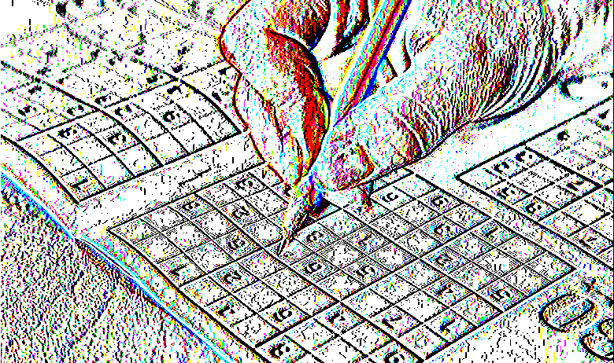
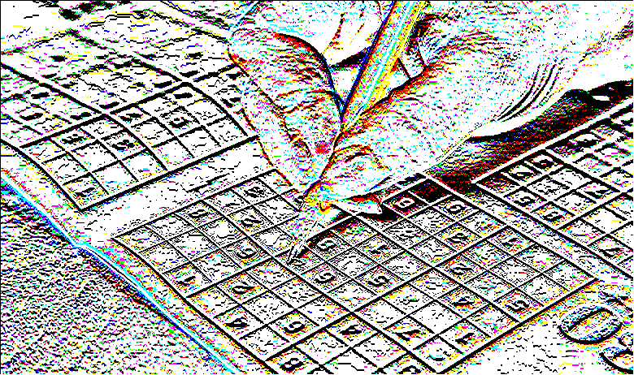
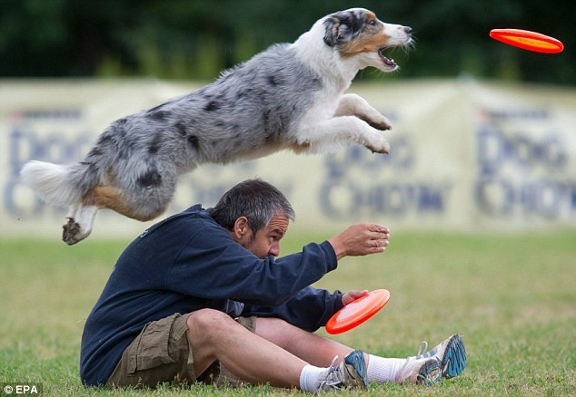

# Project 1 Report
Greg Attra  
CS 5330 Prof. Maxwell

---

## Overview

## Examples

### Part 3: Grayscale

**Before:**
 

 

**After**
 

### Part 4: Gaussian Filter

**Before:**
 

 

**After**
 

### Part 5: Sobel Filter

*Sobel X*
 

*Sobel Y*
 

### Part 7: Blur Quantize

**Before:**
 

 

**After**
 

### Part 9: Negative

**Before:**
 

 

**After**
 

## Extensions

## Reflection
- memory issue with gaussian
- type in open cv: CV_16S -> CV_16SC3

## Resources
- OpenCV documentation
- Video code sample from Project 1 assignment on Canvas