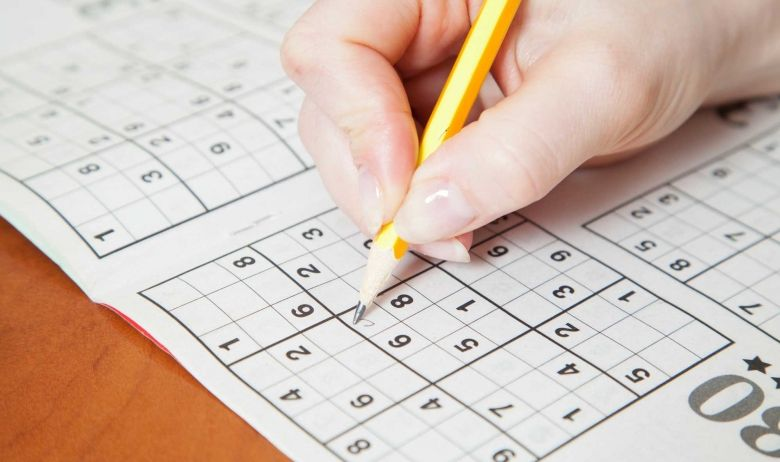

# Project 1 Report
Greg Attra  
CS 5330 Prof. Maxwell

---

## Overview
This project introduces common filters and their implementation in C++ and OpenCV. Some filters, such as the quantize filter, required a simple mathematics operation to be applied at each pixel channel. Other filters, such as the Gaussian and Sobel filters, required applying convolutions of a filter separated into two vectors. For this project, two programs were written: `ImgDisplay` which takes a path to an image and displays it in a window, and `VidDisplay`, which presents a video stream from an attached webcam and allows the user to interact with each frame through keystrokes on the keyboard. More information on these programs and how they work can be found in the `README.md`.

## Examples

While running `./VidDisplay`, users may pass the current frame through the following filters by making certain keystrokes.

### Part 3: Grayscale
The grayscale filter is applied when the user presses `g`. The program takes a color image and uses OpenCV's `cv::cvtColor` function to map the 3-channel `uchar` image to a single channel `uchar` image.

**Before:**
 

 

**After**
 

### Part 4: Gaussian Filter
The Gaussian filter is applied when the user presses `b`. The program applies the filter as two separable filters, convolving the original image with one vector, then convolving the product of that first pass with the second. For each pixel in the image, the filter computes a gaussian amplification of the pixels under the filter. This averages out the pixel values in a given region of the image, reducing sharp edges and details, thus creating a blurred effect.

**Before:**
 

 

**After**
 

### Part 5: Sobel Filter
The Sobel filter is applied when a user presses either `x` or `y`, with `x` corresponding to the SobelX filter and `y` corresponding to the SobelY filter. This filter is a classic edge detection filter. One half of the filter suppresses the region of pixels to one side of the current pixel, while the other magnifies those on the other side. If the area under the filter is entirely white or black, the product of this filter will be roughly zero, as the two sides will negate one another. Whereas, if one side of the area under the filter is white and the other black (or in other words, if there is a sharp difference in pixel values on either side of the area under the filter), the product of this filter will amplify that difference, producing a white edge in the final image.

**Before:**
 

*Sobel X*
 

*Sobel Y*
 

### Part 6: Gradient Magnitude
The Gradient Magnitude filter is applied when the user presses `m`. This filter first produces two Sobel images, one for each Sobel filter X and Y. It then iterates over each pixel location and computes the Euclidean distance between the corresponding pixel in the Sobel X image and the corresponding pixel in the Sobel Y image. This effectively combines the edges detected from both the X and Y Sobel filters. The resulting image sharpens the original Sobel edges, and magnifies them, making them more easily detectable from both a visual and mathematical standpoint.

**Before:**
 

**After**
 

### Part 7: Blur Quantize
The blur quantize filter is applied when the user presses `l`. First, the original image is blurred with the Gaussian filter described earlier. Then, the program iterates over each pixel and quantizes them by a specified level scalar. The result is an image with dramatically reduced color variation, like the image was painted with a fat brush.

**Before:**
 

 

**After**
 

### Part 8: Cartoon
The cartoon filter is applied when the user presses `c`. This filter combines the filters described so far to produce an image in the style of a cartoon. First the gradient magnitude of the original image is calculated to provide a map of the edges in the image. Separately, another image is produced which is the product of blurring the original with a Gaussian filter and then quantizing that image to reduce the color detail. Finally, the program iterates over each pixel location and references the gradient magnitude map for that pixel. If the map value for that pixel is greater than a specified threshold, the corresponding pixel in the blurred-quantized image is set to 0 (black). The final image has black outlines for the edges and coarse color detail, producing a cartoon-like image.

**Before:**
 

 

**After**
 

### Part 9: Negative
The negative filter is applied when the user presses `n`. This is a simple filter which iterates over each pixel, subtracting its value from `255`, which inverts the colors of the original image, producing a negative.

**Before:**
 

 

**After**
 

## Extensions

## Reflection
To succeed in this project, it was necessary to develop an intuitive understanding of how images are stored in memory, how the individual channels of each pixel are accessed, and how to convert between various data types like `uchar` and `signed short`. I struggled dealing with memory issues caused by improperly initializing variables. As an example: for the Gaussian filter, the temporary pointer variables which stored the product of each filter application were not zero'd out properly, resulting in an abnormal banner of strange pixel values running across the top ten rows of the final image. This was because the location in memory where the pointers pointed already contained non-zero values. So when the filter values were applied, these pre-existing values were added to the final pixel value.

Another issue similarly related to memory was in dealing with the conversion of `uchar` image pixel values to `short`. In OpenCV, when initializing a new `cv::Mat`, the data type of the mat must be specified. I had initially provided the value of `CV_16S` for 16-bit short, but encountered segmentation faults when attempting to access the individual channels for each pixel. This was solved by replacing `CV_16S` with `CV_16SC3` which stands for 16-bit short *with 3 channels*. After this change, OpenCV properly allocated three `short` locations in memory for each pixel, resolving the memory fault.

A third, more challenging issue I faced involved the Sobel filter. First, I was originally applying the filter improperly--multiplying the product of the horizontal pass with the vertical pass instead of summing them together. However, when calculating the gradient magnitude, the resulting image was a hyper-saturated color image that seemed to lose all edge-detection properties. This was because the pixel values of the Sobel image were outside the range of `[-255, 255]`. After correcting the math, the desired gradient magnitude image was achieved. However, this produced another issue: When displaying the product of the sobel filter, my program would simply display the `16SC3` image in a window. To the naked eye, this image appeared to be a blank gray canvas. However, on closer inspection, I noticed there was infact the vague resemblance of the original image, just severely muted. This is because I was now adding the horizontal pass to the vertical pass, vs. multiplying them together. When I converted to `uchar` for display, the result was what is shown above: the non-edge areas in black and the edges in white.

These challenges were certainly frustrating but through the process I gained a strong understanding of OpenCV, C++ and memory management, as well as image filtering and manipulation.

## Resources
- OpenCV documentation
- Video code sample from Project 1 assignment on Canvas