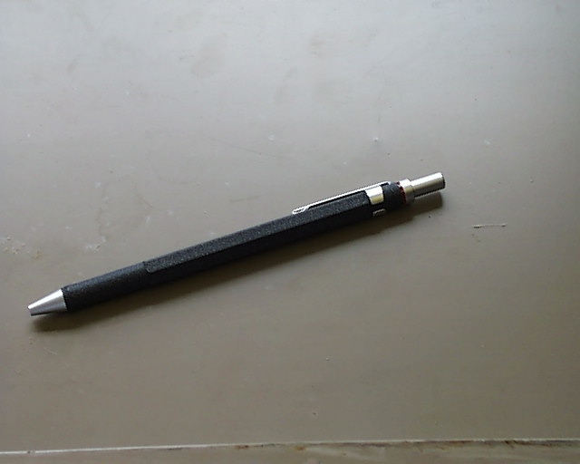

## Part 4: Color & Texture

**Without Color**
- show results for pic.0035.jpg <- good results that generally match the texture of the original image
- show results for pic.0035.jpg with just color histo <- ok results but not as good as with texture feature included
- show results for pic.0535.jpg <- bad results which have no correlation with one another
I used pic.0035.jpg as a baseline to see if the gms texture filter even really worked. in an optimal scenario it worked,
so I figured the bad results with other images was due to the fact that summing up gradient magnitudes wasn't
sophisticated enough for complex images.

**With Color**
- we see better results but still not great. if we remove the texture distance from overall distance metric, we get roughly the
same results. which indicates that the color histogram determines the lion's share of the distance between two images

## Part 5: Custom Feature Vector
**Feature Vector**

For this part, I chose to implement a feature vector consisting of a texture feature vector using Laws filters and a color feature vector of the Red/Green space of the image. The Laws filters were applied over a 100 x 100 centered slice of the image, while the R/G feature vector was built over the whole image.

I used the following combinations of Laws filters for the texture features:
- Gaussian x Spot / Spot x Gaussian
- Gaussian x Derivative / Derivative x Gaussian
- Wave x Ripple / Ripple x Wave

The responses of each were normalized by the reponse of the 5x5 Gaussian filter. At this point, the responses for each filter pair were still in the `cv::Mat` form and need to be aggregated into a vector of floats. I wanted to retain some of the spatial elements of the filter responses, so "bucketized" them by dividing the response images into 9 sections, with each section representing a bucket, and summing up the responses for each pixel within that section of the image as the bucket value. The resulting bucket vectors were concatenated into the final texture vector. So for 3 Laws filter feature vectors, there were 9 * 3 buckets in the final concatenated texture vector.

**Metric**

To measure the distance between two of these feature vectors, I split the concatenated vector into the Laws texture features and Red/Greed features respectively. I used Sum of Squared Distance for the texture features and Intersection for the Red/Green features. I weighed the texture distance by 75% and the Red/Green distance by 25%. This assumes that image content is primarily described by texture and not color, which may not always be the case (i.e. banana slices and kiwi slices have the same texture, but different color).

**Testing**

I tested this architecture using the same target image over two sets of data: `test` and `db`. `test` contained a small numer (~30) images, while `db` contained ~1000 images. However, the same images in `test` were also in `db` as a control.

Below are the results for the `test` dataset, in order of best match to worst match:

**Target Image**
 

**Results**
 

The results here are pretty good. We have images with matching content, and besides the grayscale image, roughly the same color. There are a few errant results, such as the fruit box and the pen. This could be due to the fact that the feature vector is sampled from the center 100x100 pixel section of the image.

Here are the results of the `db` dataset:

**Target Image**
 

**Results**
 

As you can tell, the results here are not as good. However, we can still see some patterns in texture, and roughly half of the images contain brick walls, like the target image. Not a complete failure, but definitely leaves room for improvement. In the `Extensions` sections below, I expand upon this initial architecture and produce much better results.

## Extensions

**Sliding Laws Filter**

**Features**

The Sliding Laws Filter architecture is a slight modification of the architecture used for Part 5. It uses Laws filters for texture and a Red/Green histogram for color. The difference, is that instead of only applying the laws filters over the 100x100 pixel center of the image, it performs a sliding window operation over the entire image, at each step computing the compelete Laws filter feature vector for the area under the window. Each of the resulting vectors were concatenated together into a final texture vector that captured the whole image, while still retaining the spatial relationship between the texture features and the source image. As with the original architecture, the area under the each window was divided into 9 buckets, further capturing spatial information about the textures in the image.

**Metrics**

The metric used to compute the distance between two feature vectors was the same as the original architecture: Sum of Squared Distance for the texture features and Intersection for the red/green histogram. The weights for each were also the same at 75% and 25% respectively.

**Results**

For the `test` dataset, the results were very good compared to the original architecture. Only two images were not of a brick wall (that damn fruit box again!). I'm actually quite stumped by the anomalies in the results: the two images of the fruit box look nothing like the other results. Still, 8/10 is not bad.

**Target Image**
 

**Results**
 

For the `db` dataset, the results are also relatively good compared to the corresponding results for the original architecture. We still have a few anomalies, but most of the images contain a brick-pattern / wall. Overall, I think this updated architecture is a noticable improvement on the original.

**Target Image**
 

**Results**
 

