## Part 1: 9x9 Square

**Features**

The feature vector is a 9 * 9 * 3 vector of the pixel values for the 9x9 center of the original image.

**Metric**

The metric used to compare two feature vectors was Sum of Squared Distance.

**Results**

Here are the top matches from the `db` dataset:

*Target Image*
 
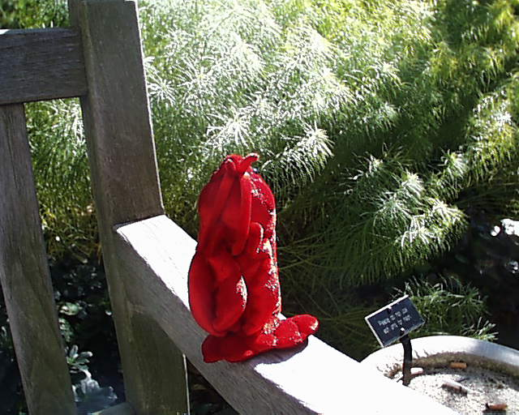

*Results*
 

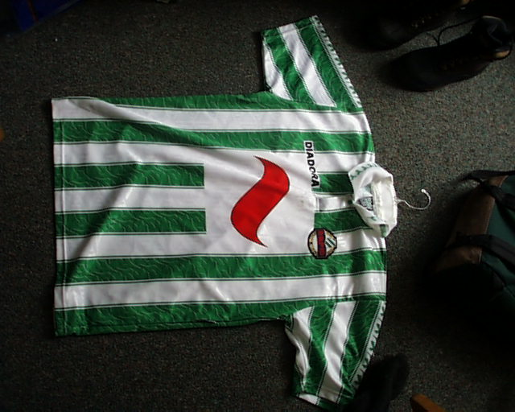
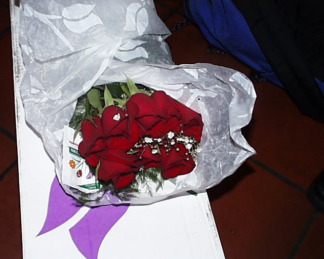

While the content is clearly not the same, there is a clear match between the red pixel values at the center of the target image and the resulting matches.

## Part 2: Color Histogram

**Features**

The feature vector is a histogram of R/G/B values bucketed into 15 buckets for each channel producing a vector size of 15 ^ 3. The vector is then normalized by the total number of pixels in the image.

**Metric**

The metric used for comparing two feature vectors is Intersection.

**Results**

Here are the top matches from the `db` dataset:

*Target Image*
 
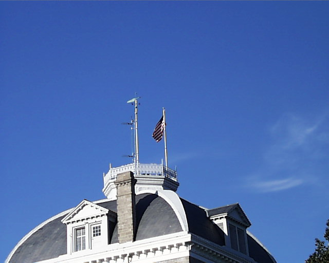

*Results*
 
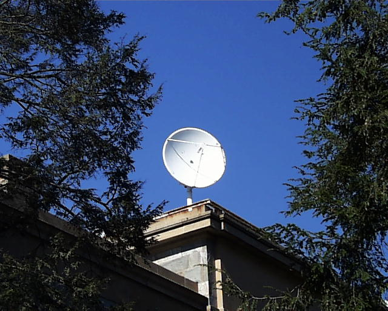
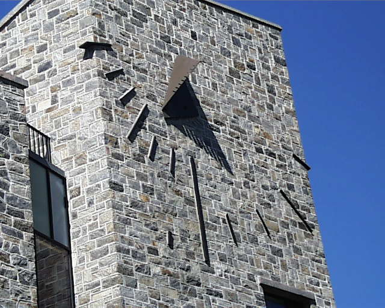
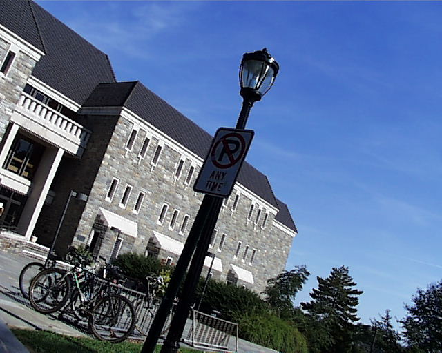

Using only color as the feature vector produced surprisingly good results. We have clear blue skies covering about half of the image in all matches and a gray building covering the other half. This is likely due to the optimal nature of the target image: a flat smooth blue skie is going to have consistent pixel values from image to image, and since the sky covers such a large portion of the image, those values will dominate the matching algorithm regardless of whatever content outside of the sky is present in the image (i.e. the buildings in this case).

## Part 3: Multiple Color Histograms

**Features**

The feature vector consists of two color histograms covering different spatial areas of the image. The first vector is a Red/Green histogram over the entire image. The second is an R/G/B histogram covering the center 100x100 pixel section of the image. Both histograms are normalized to sum to 1.0.

**Metrics**

The metric for comparing the two sub-feature vectors is the same for both--Intersection--and each are weighted equally.

**Results**

Here are the results for the images from the `db` dataset:

*Target Image*
 
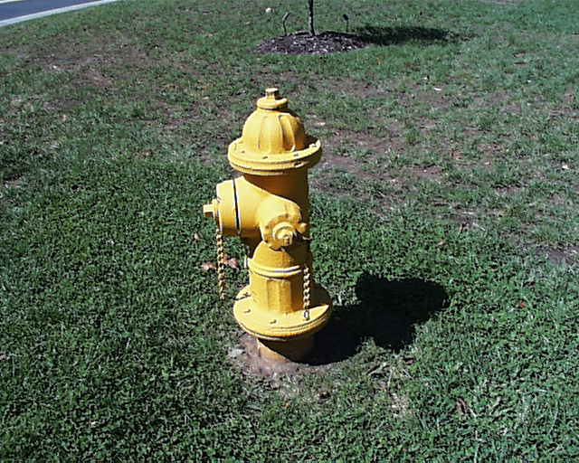

*Results*
 
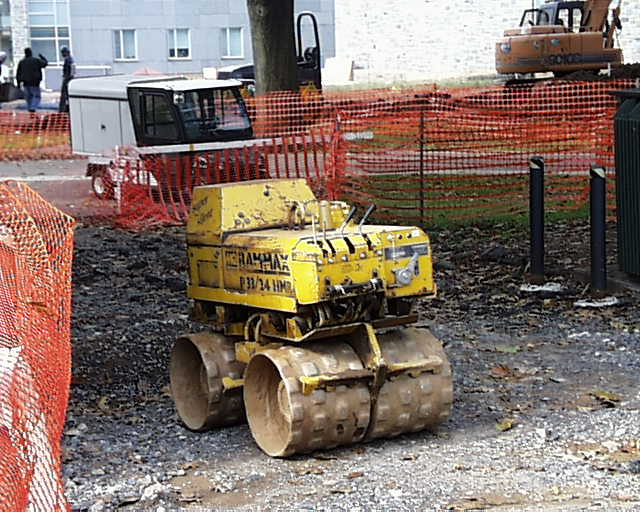
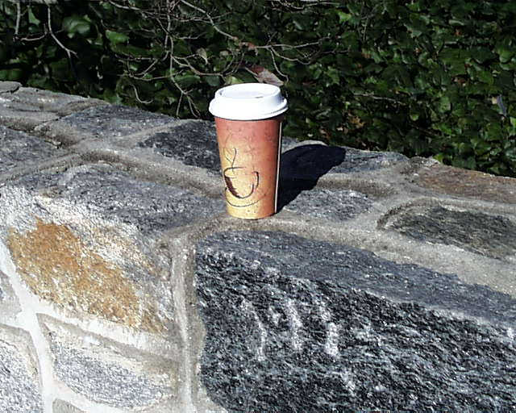
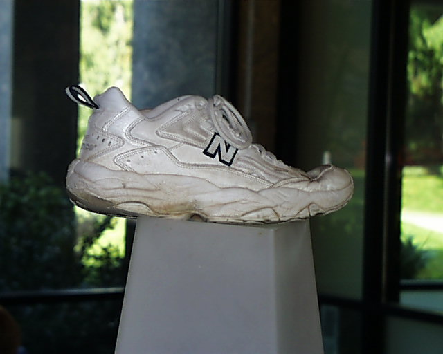

The matches here aren't that great. While the top match does contain a solid yellow color in the center, the rest of the image is not similar. The rest are even worse, though we see a strong green presence which may indicate their high rank.

## Part 4: Color & Texture
**Features**

For this part, I implemented a feature vector consisting of a whole-image Red/Green histogram and a whole-image gradient magnitude histogram. For the gradient magnitude texture-gram, I wanted to capture some spatial information about the textures in the image. To accomplish this, I divided the gradient magnitude image into 9 sections and summed the pixel values for each section into a bucket. Each of the 9 buckets would make up the texture feature vector.

**Metric**

To measure the distance between the two feature vectors, I separated the texture-gram and the color-gram, computing Intersection on each, and weighing the corresponding outputs equally.

**Testing**

As the feature vector for texture is rather simple, I wanted to test the architecture first with a set of "easy" images: where the texture in the image was simple and easily distinguishable. So I chose the following image:

This image has a smooth texture covering most of the image, with complex texture in the center. I expected that the gradient magnitude values for the buckets representing the smooth areas would be low, and the the values for the buckets representing the center area to be high. Using texture alone, the content of the resulting top images might be different, but the texture should be roughly the same. This would act as a sanity check the texture features were at least doing *something* to help find similar images.

Using the `db` dataset, here are the top results:

*Results*
 

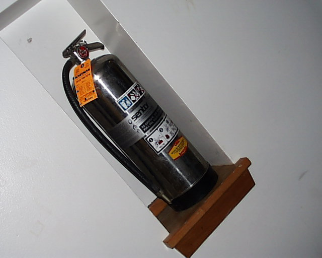

While the content of the images is not consistent, the texture is clearly consistent with the target image. We have a complex texture in the center and smooth texture everywhere else.

Now with the target image requested in the assignment:

*Target Image*
 

*Results*
 
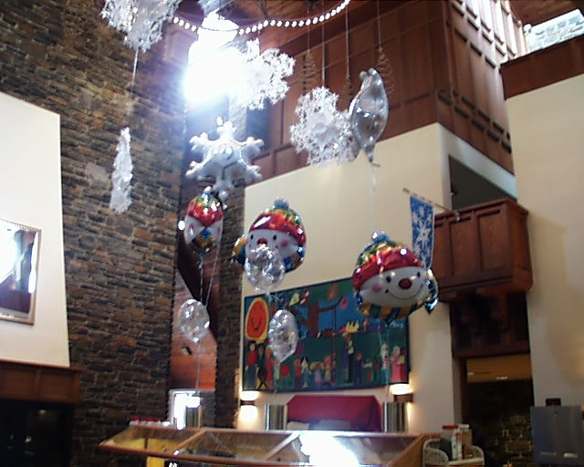
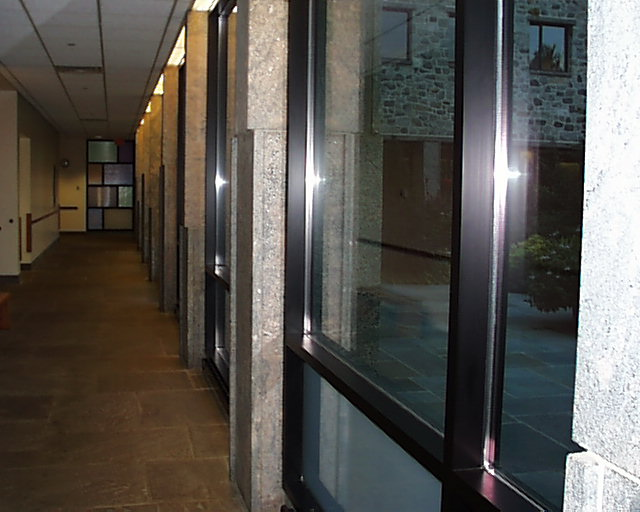
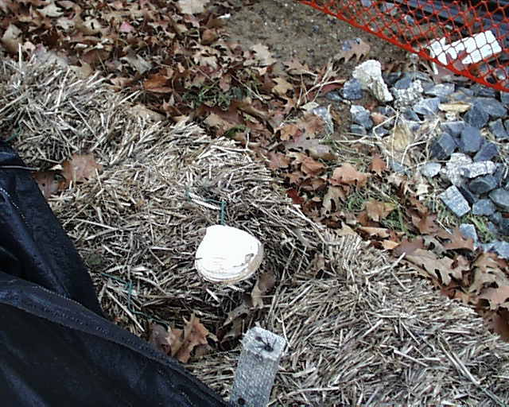

The first image is a pretty good match. It almost looks to be from the same location. We have the white chimney(?) against a stone wall and the shape of the chimney seems to match the taret image even. The 2nd and 3rd match are not so good, though we see a stone wall on the right side of the 2nd match. Color-wise, however, we can see that even the 3rd match bears resemblance to the target image with a lot of browns, grays, and a solid white object near the center.

## Part 5: Custom Feature Vector
**Features**

For this part, I chose to implement a feature vector consisting of a texture feature vector using Laws filters and a color feature vector of the Red/Green space of the image. The Laws filters were applied over a 100 x 100 centered slice of the image, while the R/G feature vector was built over the whole image.

I used the following combinations of Laws filters for the texture features:
- Gaussian x Spot / Spot x Gaussian
- Gaussian x Derivative / Derivative x Gaussian
- Wave x Ripple / Ripple x Wave

The responses of each were normalized by the reponse of the 5x5 Gaussian filter. At this point, the responses for each filter pair were still in the `cv::Mat` form and need to be aggregated into a vector of floats. I wanted to retain some of the spatial elements of the filter responses, so "bucketized" them by dividing the response images into 9 sections, with each section representing a bucket, and summing up the responses for each pixel within that section of the image as the bucket value. The resulting bucket vectors were concatenated into the final texture vector. So for 3 Laws filter feature vectors, there were 9 * 3 buckets in the final concatenated texture vector.

**Metric**

To measure the distance between two of these feature vectors, I split the concatenated vector into the Laws texture features and Red/Greed features respectively. I used Sum of Squared Distance for the texture features and Intersection for the Red/Green features. I weighed the texture distance by 75% and the Red/Green distance by 25%. This assumes that image content is primarily described by texture and not color, which may not always be the case (i.e. banana slices and kiwi slices have the same texture, but different color).

**Testing**

I tested this architecture using the same target image over two sets of data: `test` and `db`. `test` contained a small numer (~30) images, while `db` contained ~1000 images. However, the same images in `test` were also in `db` as a control.

Below are the results for the `test` dataset, in order of best match to worst match:

*Target Image*
 

*Results*
 

The results here are pretty good. We have images with matching content, and besides the grayscale image, roughly the same color. There are a few errant results, such as the fruit box and the pen. This could be due to the fact that the feature vector is sampled from the center 100x100 pixel section of the image.

Here are the results of the `db` dataset:

*Target Image*
 

*Results*
 

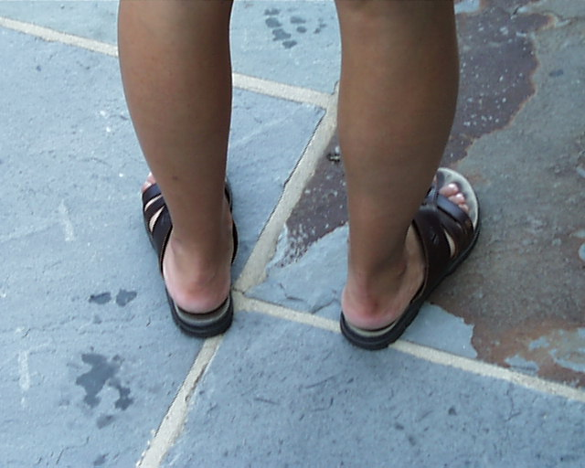
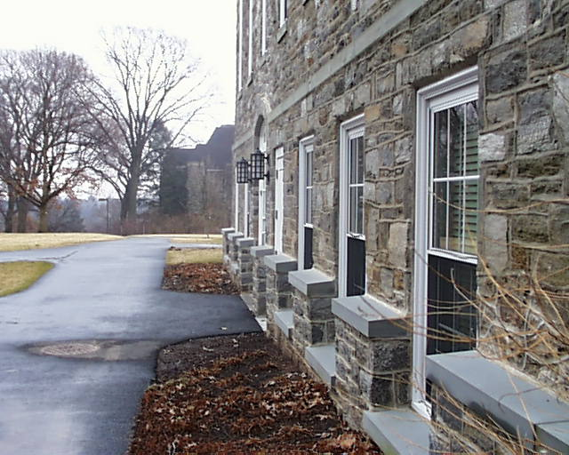

As you can tell, the results here are not as good. However, we can still see some patterns in texture, and roughly half of the images contain brick walls, like the target image. Not a complete failure, but definitely leaves room for improvement. In the `Extensions` section below, I expand upon this initial architecture and produce much better results.

## Extensions

**Sliding Laws Filter**

**Features**

The Sliding Laws Filter architecture is a slight modification of the architecture used for Part 5. It uses Laws filters for texture and a Red/Green histogram for color. The difference, is that instead of only applying the laws filters over the 100x100 pixel center of the image, it performs a sliding window operation over the entire image, at each step computing the compelete Laws filter feature vector for the area under the window. Each of the resulting vectors were concatenated together into a final texture vector that captured the whole image, while still retaining the spatial relationship between the texture features and the source image. As with the original architecture, the area under the each window was divided into 9 buckets, further capturing spatial information about the textures in the image.

**Metrics**

The metric used to compute the distance between two feature vectors was the same as the original architecture: Sum of Squared Distance for the texture features and Intersection for the red/green histogram. The weights for each were also the same at 75% and 25% respectively.

**Results**

For the `test` dataset, the results were very good compared to the original architecture. Only two images were not of a brick wall. I'm actually quite stumped by the anomalies in the results: the two images of the fruit box look nothing like the other results. Still, 8/10 is not bad.

*Target Image*
 

*Results*
 

For the `db` dataset, the results are also relatively good compared to the corresponding results for the original architecture. We still have a few anomalies, but most of the images contain a brick-pattern / wall. Overall, I think this updated architecture is a noticable improvement on the original.

*Target Image*
 

*Results*
 

