# 2D Object Recognition

### Greg Attra
### CS 5330

## Confusion Matrix

To evaluate the performance of the system, I ran 5 classifications for each of the 10 objects known to the system. I also ran classifications for new objects the system had not yet seen, but were similar to known objects. For example, while the system was given features for one set of headphones, I ran classification on a different set of headphones which looked similar.

Overall the system performed well. Misclassifications only took place when the object was partially out of the camera frame or there were significant shadows present. The one exception to that was the glove, which had a tendancy to be misclassified as a flipflop even when well lit and within the frame.

**Objects**
 
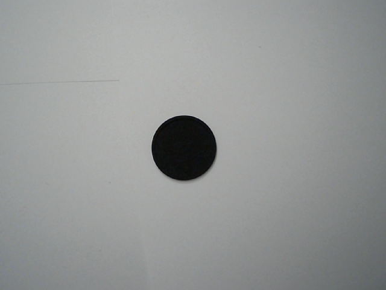
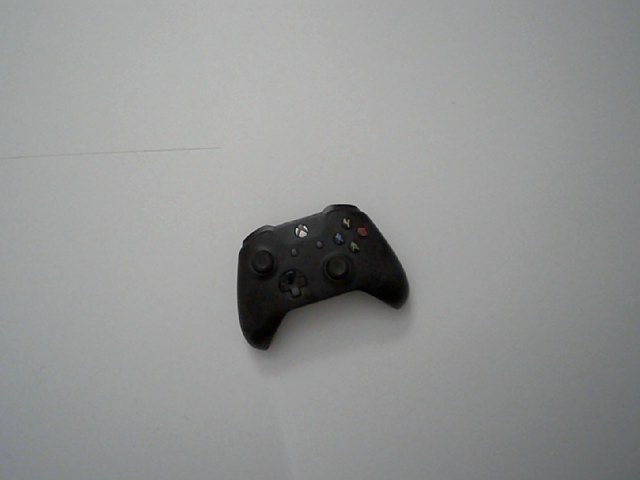
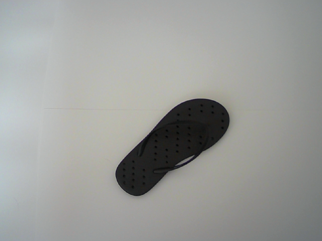
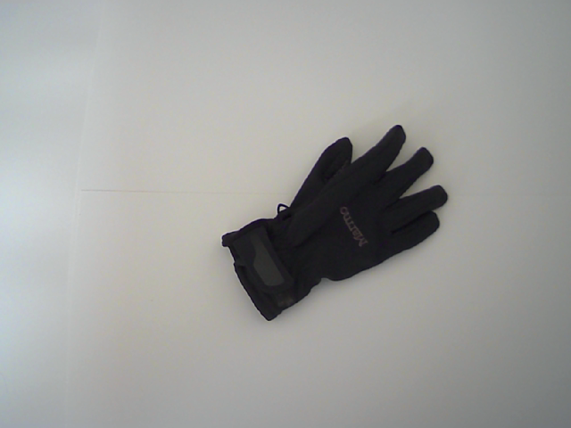
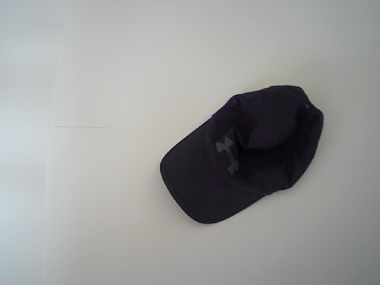
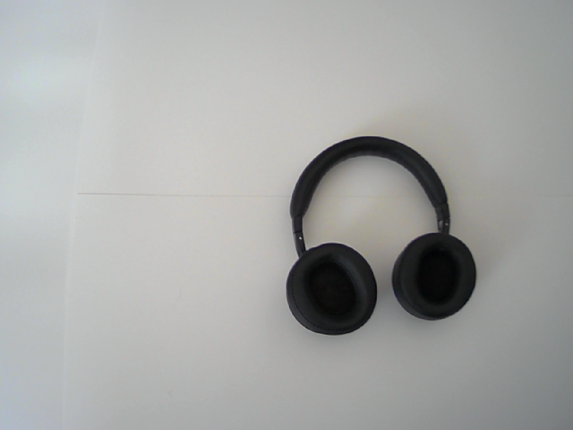

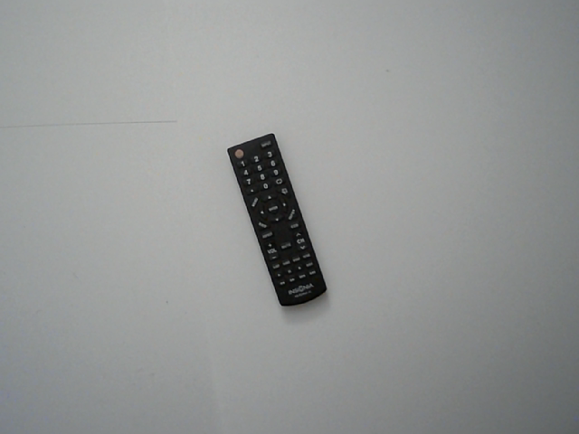
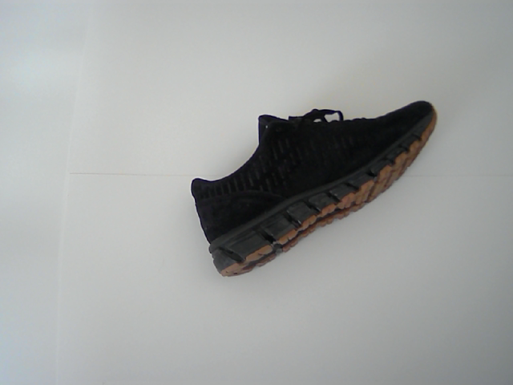
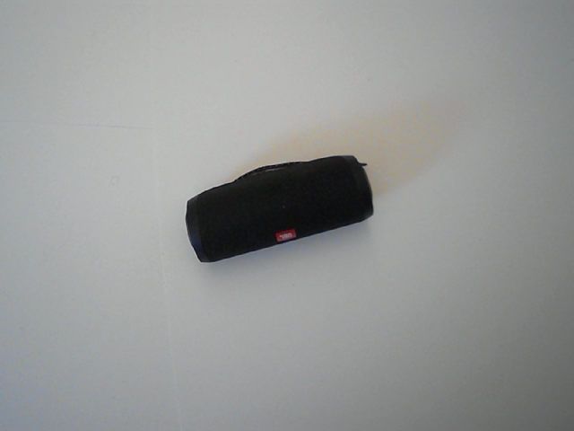
 
*Unlabeled Objects*
 
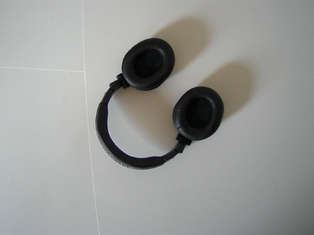
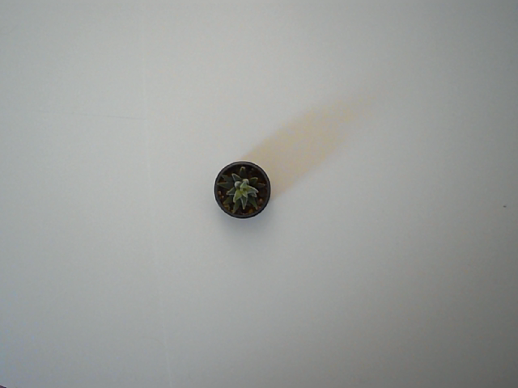
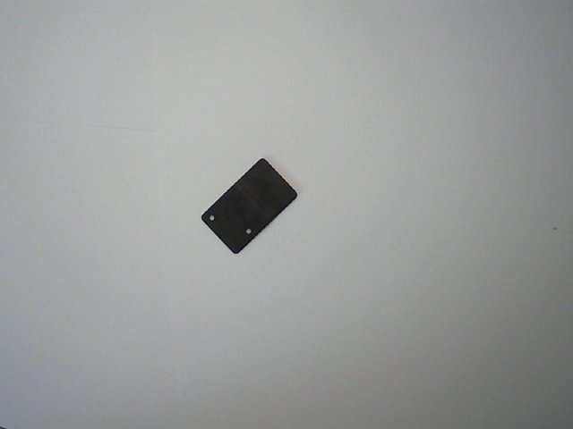

**Confusion Matrix:**

(Actual on the top row, Prediction along the side)

<table>
    <tr>
        <th><strong>Predicted | Actual</strong></th>
        <th><strong>Coaster</strong></th>
        <th><strong>Controller</strong></th>
        <th><strong>Flipflop</strong></th>
        <th><strong>Glove</strong></th>
        <th><strong>Hat</strong></th>
        <th><strong>Headphone</strong></th>
        <th><strong>Phone</strong></th>
        <th><strong>Remote</strong></th>
        <th><strong>Shoe</strong></th>
        <th><strong>Speaker</strong></th>
    </tr>
    <tr>
        <th><strong>Coaster</strong></td>
        <td>5</td>
        <td>0</td>
        <td>0</td>
        <td>0</td>
        <td>0</td>
        <td>0</td>
        <td>0</td>
        <td>0</td>
        <td>0</td>
        <td>0</td>
    </tr>
    <tr>
        <th><strong>Controller</strong></td>
        <td>1</td>
        <td>3</td>
        <td>0</td>
        <td>0</td>
        <td>0</td>
        <td>0</td>
        <td>0</td>
        <td>1</td>
        <td>0</td>
        <td>0</td>
    </tr>
    <tr>
        <th><strong>Flipflop</strong></td>
        <td>0</td>
        <td>0</td>
        <td>4</td>
        <td>0</td>
        <td>0</td>
        <td>0</td>
        <td>0</td>
        <td>1</td>
        <td>0</td>
        <td>0</td>
    </tr>
    <tr>
        <th><strong>Glove</strong></td>
        <td>0</td>
        <td>0</td>
        <td>2</td>
        <td>3</td>
        <td>0</td>
        <td>0</td>
        <td>0</td>
        <td>0</td>
        <td>0</td>
        <td>0</td>
    </tr>
    <tr>
        <th><strong>Hat</strong></td>
        <td>0</td>
        <td>0</td>
        <td>1</td>
        <td>0</td>
        <td>4</td>
        <td>0</td>
        <td>0</td>
        <td>0</td>
        <td>0</td>
        <td>0</td>
    </tr>
    <tr>
        <th><strong>Headphone</strong></td>
        <td>0</td>
        <td>0</td>
        <td>0</td>
        <td>0</td>
        <td>0</td>
        <td>5</td>
        <td>0</td>
        <td>0</td>
        <td>0</td>
        <td>0</td>
    </tr>
    <tr>
        <th><strong>Phone</strong></td>
        <td>0</td>
        <td>0</td>
        <td>0</td>
        <td>0</td>
        <td>0</td>
        <td>0</td>
        <td>4</td>
        <td>1</td>
        <td>0</td>
        <td>0</td>
    </tr>
    <tr>
        <th><strong>Remote</strong></td>
        <td>0</td>
        <td>0</td>
        <td>0</td>
        <td>0</td>
        <td>0</td>
        <td>0</td>
        <td>0</td>
        <td>5</td>
        <td>0</td>
        <td>0</td>
    </tr>
    <tr>
        <th><strong>Shoe</strong></td>
        <td>0</td>
        <td>0</td>
        <td>0</td>
        <td>0</td>
        <td>0</td>
        <td>0</td>
        <td>0</td>
        <td>0</td>
        <td>4</td>
        <td>1</td>
    </tr>
    <tr>
        <th><strong>Speaker</strong></td>
        <td>0</td>
        <td>0</td>
        <td>0</td>
        <td>0</td>
        <td>0</td>
        <td>0</td>
        <td>0</td>
        <td>2</td>
        <td>0</td>
        <td>3</td>
    </tr>
    <tr>
        <td>UNLABELED OBJECTS:</td>
    </tr>
    <tr>
        <th><strong>Alt. Headphones</strong></td>
        <td>0</td>
        <td>0</td>
        <td>0</td>
        <td>0</td>
        <td>0</td>
        <td>5</td>
        <td>0</td>
        <td>0</td>
        <td>0</td>
        <td>0</td>
    </tr>
    <tr>
        <th><strong>Plant Pot</strong></td>
        <td>5</td>
        <td>0</td>
        <td>0</td>
        <td>0</td>
        <td>0</td>
        <td>0</td>
        <td>0</td>
        <td>0</td>
        <td>0</td>
        <td>0</td>
    </tr>
    <tr>
        <th><strong>Metal Brace</strong></td>
        <td>0</td>
        <td>0</td>
        <td>0</td>
        <td>0</td>
        <td>0</td>
        <td>0</td>
        <td>2</td>
        <td>3</td>
        <td>0</td>
        <td>0</td>
    </tr>
</table>