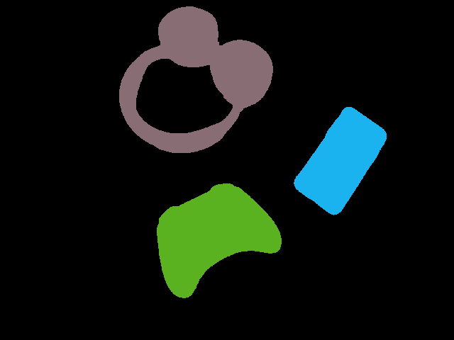

# 2D Object Recognition

### Greg Attra
### CS 5330

## Overview

The OR2D program is a real-time 2D object recognition program which uses thresholding to isolate regions of an image, segmentation to label those regions, and computes moments on those regions to extract translation and rotation invariant features about the object. Once those features have been aquired, they are labeled and saved to be used for classification. 

## Threshold
This is the first step in the object recognition pipeline. With the program running, press `t` to threshold the image. The user will be prompted enter the intensity value with which to threshold the image. The result will be a binary image with the background in black and the object in white.

**Examples:**
<br>


## Segment
This step succeeds the threshold step and labels each region with an id, coloring the regions as well. To segment an image, press `s`. The user will be prompted to enter the max number of regions to segment.

**Examples:**
<br>




## Features
This step follows the segment step and computes translation and rotation invariant features for each region in the segmented image. These features, such as the oriented bounding box, are drawn on the image and displayed. Press `f` to compute features on the image.


## Label
This step takes the features computed a region and labels them, storing these features in a file in the `labels/` directory. Each file can store multiple samples. To initiate this step, press `l`. The user will be prompted to enter the label of the object. This will capture one feature sample and save it to the data file. To capture another, simply press `l` again and repeat the process.

**Note**: this step assumes that only one object is present in the image. If there are multiple objects, whichever object is labeled as region 1 will be labeled.

## Classify
This step classifies an image by computing its features and finding the closest matching feature set from the datafiles in the `labels/` directory. Press `c` to classify objects. It uses the following equation to compute the distances:
```
float distance = 1 - (min(feature_A, feature_B) / max(feature_A, feature_B))
```
### KNN Classify
There is also the ability to classify objects using a K-nearest neighbors classifier. Press `k` to classify objects using this algorithm. The user will be prompted to specify the value for `K` (the number of numbers to sample for each label).

**Examples:**
<br>


## Confusion Matrix

To evaluate the performance of the system, I ran 5 classifications for each of the 10 objects known to the system. I also ran classifications for new objects the system had not yet seen, but were similar to known objects. For example, while the system was given features for one set of headphones, I ran classification on a different set of headphones which looked similar.

Overall the system performed well. Misclassifications only took place when the object was partially out of the camera frame or there were significant shadows present. The one exception to that was the glove, which had a tendancy to be misclassified as a flipflop even when well lit and within the frame.

**Objects**
<br>


<br>
*Unlabeled Objects*
<br>


**Confusion Matrix:**

(Actual on the top row, Prediction along the side)

<table>
    <tr>
        <th><strong>Predicted | Actual</strong></th>
        <th><strong>Coaster</strong></th>
        <th><strong>Controller</strong></th>
        <th><strong>Flipflop</strong></th>
        <th><strong>Glove</strong></th>
        <th><strong>Hat</strong></th>
        <th><strong>Headphone</strong></th>
        <th><strong>Phone</strong></th>
        <th><strong>Remote</strong></th>
        <th><strong>Shoe</strong></th>
        <th><strong>Speaker</strong></th>
    </tr>
    <tr>
        <th><strong>Coaster</strong></td>
        <td>5</td>
        <td>0</td>
        <td>0</td>
        <td>0</td>
        <td>0</td>
        <td>0</td>
        <td>0</td>
        <td>0</td>
        <td>0</td>
        <td>0</td>
    </tr>
    <tr>
        <th><strong>Controller</strong></td>
        <td>1</td>
        <td>3</td>
        <td>0</td>
        <td>0</td>
        <td>0</td>
        <td>0</td>
        <td>0</td>
        <td>1</td>
        <td>0</td>
        <td>0</td>
    </tr>
    <tr>
        <th><strong>Flipflop</strong></td>
        <td>0</td>
        <td>0</td>
        <td>4</td>
        <td>0</td>
        <td>0</td>
        <td>0</td>
        <td>0</td>
        <td>1</td>
        <td>0</td>
        <td>0</td>
    </tr>
    <tr>
        <th><strong>Glove</strong></td>
        <td>0</td>
        <td>0</td>
        <td>2</td>
        <td>3</td>
        <td>0</td>
        <td>0</td>
        <td>0</td>
        <td>0</td>
        <td>0</td>
        <td>0</td>
    </tr>
    <tr>
        <th><strong>Hat</strong></td>
        <td>0</td>
        <td>0</td>
        <td>1</td>
        <td>0</td>
        <td>4</td>
        <td>0</td>
        <td>0</td>
        <td>0</td>
        <td>0</td>
        <td>0</td>
    </tr>
    <tr>
        <th><strong>Headphone</strong></td>
        <td>0</td>
        <td>0</td>
        <td>0</td>
        <td>0</td>
        <td>0</td>
        <td>5</td>
        <td>0</td>
        <td>0</td>
        <td>0</td>
        <td>0</td>
    </tr>
    <tr>
        <th><strong>Phone</strong></td>
        <td>0</td>
        <td>0</td>
        <td>0</td>
        <td>0</td>
        <td>0</td>
        <td>0</td>
        <td>4</td>
        <td>1</td>
        <td>0</td>
        <td>0</td>
    </tr>
    <tr>
        <th><strong>Remote</strong></td>
        <td>0</td>
        <td>0</td>
        <td>0</td>
        <td>0</td>
        <td>0</td>
        <td>0</td>
        <td>0</td>
        <td>5</td>
        <td>0</td>
        <td>0</td>
    </tr>
    <tr>
        <th><strong>Shoe</strong></td>
        <td>0</td>
        <td>0</td>
        <td>0</td>
        <td>0</td>
        <td>0</td>
        <td>0</td>
        <td>0</td>
        <td>0</td>
        <td>4</td>
        <td>1</td>
    </tr>
    <tr>
        <th><strong>Speaker</strong></td>
        <td>0</td>
        <td>0</td>
        <td>0</td>
        <td>0</td>
        <td>0</td>
        <td>0</td>
        <td>0</td>
        <td>2</td>
        <td>0</td>
        <td>3</td>
    </tr>
    <tr>
        <td>UNLABELED OBJECTS:</td>
    </tr>
    <tr>
        <th><strong>Alt. Headphones</strong></td>
        <td>0</td>
        <td>0</td>
        <td>0</td>
        <td>0</td>
        <td>0</td>
        <td>5</td>
        <td>0</td>
        <td>0</td>
        <td>0</td>
        <td>0</td>
    </tr>
    <tr>
        <th><strong>Plant Pot</strong></td>
        <td>5</td>
        <td>0</td>
        <td>0</td>
        <td>0</td>
        <td>0</td>
        <td>0</td>
        <td>0</td>
        <td>0</td>
        <td>0</td>
        <td>0</td>
    </tr>
    <tr>
        <th><strong>Metal Brace</strong></td>
        <td>0</td>
        <td>0</td>
        <td>0</td>
        <td>0</td>
        <td>0</td>
        <td>0</td>
        <td>2</td>
        <td>3</td>
        <td>0</td>
        <td>0</td>
    </tr>
</table>
<br>

## Video Demo
Here is a demo of the system in action: https://youtu.be/iPKZYy79JhM

## Extensions

**Multi-object Recognition**

As the video shows, the system can classify up to N objects simultaneously, where N is the number of regions specified by the user. To provide this value, press `d` and a prompt will request the max number of regions to segment.

**Extra Feature Detection/Display**

For each region, the system computes the bounding box and oriented bounding box, displaying each in the output image, along with the height and width of the oriented bounding box.