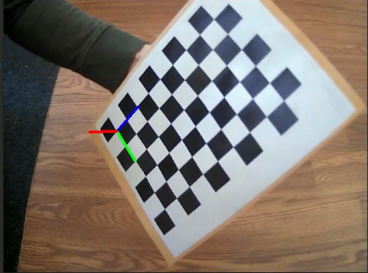
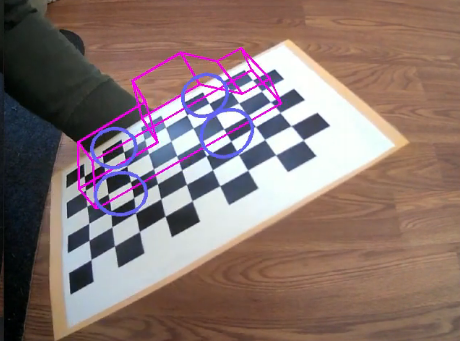
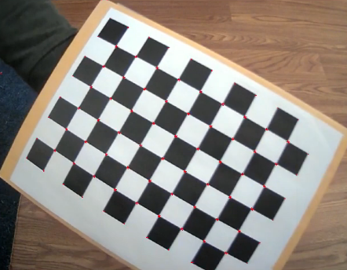

# Project 4: Augmented Reality
Greg Attra | CS 5335 Prof. Maxwell

# Overview

This project focused on the foundamentals of augmented reality using a checkerboard pattern to track and project onto. The first part focused on camera calibration, which consisted of finding the corners of the checkerboard and compiling a small dataset of images with the checkerboard at various translations and rotations with respect to the camera, and then using those samples to predict a camera calibration model. The second half consisted of using the predicted intrinsic parameters to track and project objects onto the checkerboard.

[Here is a video](https://youtu.be/ZmhS2BurlAU) of the program in action: https://youtu.be/ZmhS2BurlAU

# Implementation

## Calibration

The Calibration process can be broken into three parts:

1. Detect the pixel locations of the checkboard corners at various translations and rotations
2. Save N samples of these pixel locations and assign each a 3D coordinate
3. Use the saved samples to predict the intrinsic parameters of the camera

### Detecting the checkerboard

Using OpenCV's API we can find the corners of the checkerboard as follows:
```
cv::findChessboardCorners(*img, size, corners, flags);
```

Where `img` is the target image, `size` is the size of the checkerboard in number of cells on each axis, and `corners` is a buffer to store the corner locations.

Using OpenCV's `drawChessboardCorners()`, we can visualize the found corners:


### Saving samples

We can press `s` to save the detected corner pixel locations and assign them 3D world points. In this case, the program measures the world in units of checkerborad squares (i.e. the top left square is at coordinate `(0, 0, 0)` in the checkerboard frame).

### Calibrating the camera

Once we have at least 5 samples saved, we can calibrate the camera:

```
calibration.final_proj_err = cv::calibrateCamera(
        points_list,
        corners_list,
        size,
        calibration.camera_matrix,
        calibration.dist_coeffs,
        rotations,
        transformations,
        cv::CALIB_FIX_ASPECT_RATIO);
```

Where `points_list` is a vector of vectors each holding the 3D points for each corner set and `corners_list` is a vector of vectors each holding the detected corner locations.

The program will output the predicted intrinsic parameters:


### Saving and loading the parameters

Pressing `w` will write the intrinsic parameters to a file in `files/params`. These params can be loaded from this file by pressing `l`.

## Projection

Object projection consists of two parts:

1. Detect the pose of the checkerboard
2. Use the pose to project the object onto the checkerboard

### Pose detection

Once intrinsic parameters of sufficient quality (with a reprojection error of < `.5` pixels) we can move onto projection. To project an object onto an image, we first need to predict the checkerboard's translation and rotation. We can do this using OpenCV's `solvePnP()` method:

```
cv::solvePnP(
    points,
    corners,
    calibrator->calibration.camera_matrix,
    calibrator->calibration.dist_coeffs,
    pose.rotation,
    pose.translation);
```

Where `corners` are the pixel locations for the detected checkerboard corners and `points` are the 3D position for each corner. The `camera_matrix` and `dist_coeffs` are the loaded intrinsic params computed in the `Calibration` phase.

We then draw the checkerboard 3D axis onto the checkerboard:



### Objection projection

Once we have the pose, we can use OpenCV's `projectPoints()` function to project the points corresponding to the lines comprising the object we want to project.

For example, to project the wheels of a truck onto the checkerboard, we pass in the 3D points comprising the wheel:

```
cv::projectPoints(
        wheel_points,
        pose.rotation,
        pose.translation,
        pose.camera_matrix,
        pose.dist_coeffs,
        img_points);
```

This will populate `img_points` with the pixel locations for each of the `wheel_points`.

We can then draw lines to connect these pixel points to project the object on the checkboard:



## Harris Corners

Another way of tracking an object moving in an image is to use the Harris equation to detect strong corners. The `./HarrisCorners` program does this:



Here the detected Harris Corners are marked in red (it may be difficult to see).

# Reflection

This project came together relatively quickly for me, mostly due to OpenCV's API doing a lot of the heavy lifting. Where I struggled the most was in developing an intuitive sense of the projection from 3D to 2D. Once this clicked with me, I was able to create points for the truck object with relative ease.

I am excited by the applications of AR. It was fun to explore the underlying mechanics of how it is accomplished and I plan to incorporate it into future projects. I like the idea of using AR to enable a human to instruct a robot to move to a target location.

# Acknowledgements

- [OpenCV Calibration Tutorial](https://docs.opencv.org/master/d4/d94/tutorial_camera_calibration.html)
- [OpenCV Pose Estimation Tutorial](https://docs.opencv.org/master/d7/d53/tutorial_py_pose.html)
- [OpenCV Harris Corners Tutorial](https://opencv-python-tutroals.readthedocs.io/en/latest/py_tutorials/py_feature2d/py_features_harris/py_features_harris.html)
