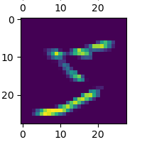

# Project 5: Recognition with Deep Learning
**Greg Attra**<br>
**CS 5330 Prof. Maxwell**

## Overview

This project uses deep neural networks to learn features in an image set and fit a model to
those features. I explored fitting a multilayer convolutional neural network to the MNIST
digit dataset, and used that trained model to produce an embedding space for an imageset of Greek
letters. I also visualized the internals of the trained model, plotting the learned filters
and their effect on the source image. Finally, I experimented with variations in the neural network
architecture to fit a model to the MNIST fashion dataset, adjusting the number of convolutional layers,
filter size and number of filters. This process was fully automated and implements each possible
combination of the tweakable parameters.

## Implementation

### Part 1: Training

For this part, I built the following Keras model, compiled it, and trained it to fit the MNIST
number dataset:

```
m = keras.Sequential([
    keras.Input(shape=input_shape),
    layers.Conv2D(32, kernel_size=(3, 3), activation="relu"),
    layers.Conv2D(32, kernel_size=(3, 3), activation="relu"),
    layers.MaxPooling2D(pool_size=(2, 2)),
    layers.Dropout(0.5),
    layers.Flatten(),
    layers.Dense(128, activation="relu"),
    layers.Dropout(0.5),
    layers.Dense(n_classes, activation="softmax")
])
```

Here are some example samples from the MNIST dataset:


The resulting accuracy:


When evaluating custom, handwritten samples, the model performed poorly:
```
Test loss:  1.1977448463439941
Test acc:  0.6000000238418579
```

This is likely due to a few things:
1. The handwritten digits are written using a slightly thinner lines;
2. The downsized images are more pixelated than the training data
3. The digits in the custom dataset are smaller in size than the original dataset


### Part 2: Examining

To get a better understanding of how the model processes data, I plot the learned filters
of the first conv layer in the model.


When applying these filters using OpenCV's `filter2D` function, the resuling images are as
follows:


Thinking on well known filters, such as the SobelX and SobelY filters, I think these results
make sense given the weights of the filters. For example, the filter below closely
resembles the horizontal Sobel filter.


When applied to the image, we see that the horizontal
edges become more pronounced, which is the effect of the horizontal Sobel filter.



If we truncate the model after the first conv layer and compare the resulting images, we see
virtually identical results:


Truncating one layer deeper, we get the following results:


Here we see similar features--vertical, horizontal, and angled edges--but with a spatital
component factored in as well. Some filters look for edges in the top right or lower left.
Others trace a subtle outline around parts of the number.

### Part 3: Embedding

For this part, I use the pretrained model from the MNIST number dataset to create 128 dimensional
embedding space for an imageset of the Greek letters alpha, beta and gamma.